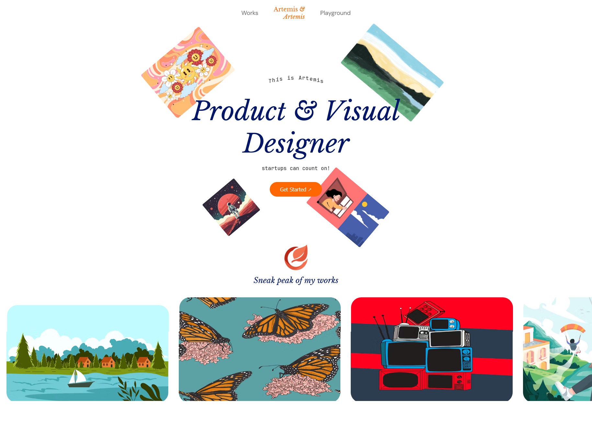

# Practice Project

This page is a personal design practice. It includes four main sections focused on layout, animations, and visual atmosphere.

## Inspiration

I drew inspiration from editorial styles and modern UI components found across various websites. The goal was to explore visual modularity and experiment with animated entrances using real-world design references.

## Technologies

- HTML5  
- CSS3 (with animations and transformations)  
- JavaScript (for interactions)

## Purpose

To practice visual design and modular structure through hands-on experimentation.

## Author

Eduardo – Self-taught visual architect in expansion 🚀
